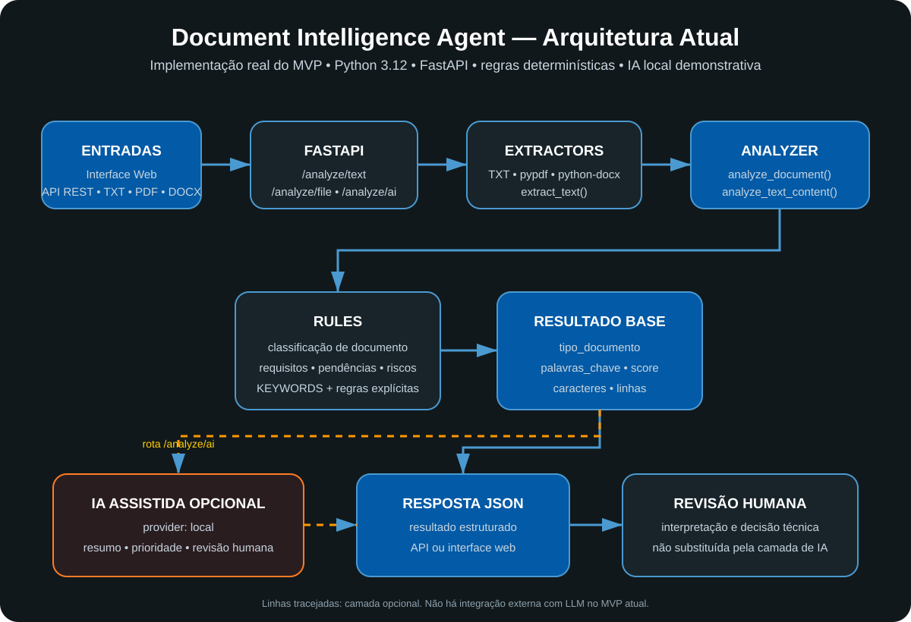

# Document Intelligence Agent

🇧🇷 Português | [🇺🇸 English](README.en.md) | [🇪🇸 Español](README.es.md)

[](https://github.com/sayjinblackbelt/document-intelligence-agent/actions/workflows/ci.yml)
[](https://www.python.org/)
[](https://www.docker.com/)

> API e interface web para análise estruturada de documentos com Python, regras determinísticas e uma camada opcional de IA assistida.

## Visão geral

O **Document Intelligence Agent** demonstra como automatizar etapas iniciais da análise documental sem depender exclusivamente de modelos de IA.

A arquitetura separa:

- **extração de conteúdo**;
- **análise determinística e reproduzível**;
- **classificação e identificação de requisitos, pendências e riscos**;
- **camada opcional de análise assistida por IA**;
- **revisão humana para decisões técnicas**.

Essa abordagem prioriza rastreabilidade e previsibilidade, permitindo evoluir o sistema com LLMs sem substituir a camada de regras.

## Principais recursos

- 📄 Suporte a **TXT, PDF e DOCX**;
- 🔎 identificação de requisitos, pendências e riscos;
- 🏷️ classificação inicial de documentos;
- 📊 score de completude;
- 🤖 camada de IA assistida com adaptadores desacoplados;
- 🌐 API REST com FastAPI;
- 🖥️ interface web;
- 🧪 testes automatizados para motor e API;
- 🔄 CI com GitHub Actions;
- 🐳 execução com Docker;
- 🩺 healthcheck para monitoramento básico.

## Arquitetura



O projeto separa a extração, o motor determinístico e a camada opcional de IA. O MVP atual usa apenas o provider `local`; integrações externas com LLMs permanecem como evolução futura.

[Ver documentação detalhada da arquitetura →](docs/ARCHITECTURE.md)

## Stack

| Área | Tecnologias |
|---|---|
| Backend | Python 3.12, FastAPI |
| Extração | pypdf, python-docx |
| Testes | pytest |
| API | FastAPI, Pydantic |
| Servidor | Uvicorn |
| Container | Docker |
| Automação | GitHub Actions |

## Início rápido

### Execução local

```bash
git clone https://github.com/sayjinblackbelt/document-intelligence-agent.git
cd document-intelligence-agent

python -m venv .venv
source .venv/bin/activate
```

No Windows:

```powershell
.venv\Scripts\Activate.ps1
```

Instale as dependências:

```bash
pip install -r requirements.txt
```

Execute a aplicação:

```bash
uvicorn app.api:app --reload
```

Abra:

- Interface web: `http://127.0.0.1:8000/`
- Healthcheck: `http://127.0.0.1:8000/health`
- Documentação interativa: `http://127.0.0.1:8000/docs`

## API

### Health

```http
GET /health
```

### Analisar texto

```http
POST /analyze/text
```

Exemplo:

```json
{
  "filename": "projeto.txt",
  "content": "REQUISITOS: registrar documentos. PENDÊNCIA: revisar. RISCO: atraso."
}
```

### Analisar arquivo

```http
POST /analyze/file
```

Formatos aceitos:

- TXT
- PDF com texto extraível
- DOCX

### Análise assistida

```http
POST /analyze/ai
```

O modo `local` funciona sem chave de API e demonstra a arquitetura assistiva.

> A resposta assistida usa um contrato JSON consistente:

```json
{
  "resumo_executivo": "...",
  "requisitos": [],
  "pendencias": [],
  "riscos": [],
  "prioridade_sugerida": "baixa",
  "revisao_humana_recomendada": true
}
```

OpenAI e Ollama são instruídos a retornar JSON, e a API valida a estrutura antes de devolver o resultado.

Os resultados da camada de IA não substituem revisão técnica ou decisão humana.

Para detalhes adicionais, consulte a [Documentação da API](docs/API.md).

## Testes

Execute todos os testes:

```bash
pytest -q
```

A suíte atual cobre:

- motor de análise;
- análise de diretórios;
- health endpoint;
- análise de texto;
- upload de arquivo;
- validação de formatos;
- análise assistida;
- tratamento de provider não configurado.

## CI

O GitHub Actions executa automaticamente em:

- push para `main`;
- pull requests para `main`.

O pipeline:

```text
PUSH / PULL REQUEST
        ↓
INSTALAR DEPENDÊNCIAS
        ↓
PYTEST
        ↓
DOCKER BUILD
```

## Docker

Build:

```bash
docker build -t document-intelligence-agent .
```

Execução:

```bash
docker run -p 8000:8000 document-intelligence-agent
```

O container:

- executa com usuário não-root;
- utiliza dependências versionadas;
- possui healthcheck;
- permite configuração da porta pela variável `PORT`.

## Estrutura

```text
document-intelligence-agent/
├── app/
│   ├── analyzer.py
│   ├── api.py
│   ├── ai_analysis.py
│   ├── extractors.py
│   ├── rules.py
│   └── static/
├── tests/
│   ├── test_analyzer.py
│   └── test_api.py
├── docs/
│   ├── API.md
│   ├── ARCHITECTURE.md
│   ├── DEPLOYMENT.md
│   └── ROADMAP.md
├── .github/
│   └── workflows/
│       └── ci.yml
├── Dockerfile
├── render.yaml
├── requirements.txt
└── README.md
```

## Roadmap

### Concluído

- [x] Motor determinístico de análise;
- [x] API REST;
- [x] suporte a TXT;
- [x] suporte a PDF;
- [x] suporte a DOCX;
- [x] testes automatizados;
- [x] interface web;
- [x] camada local de IA assistida;\n- [x] arquitetura de adaptadores de IA;\n- [x] integração opcional com OpenAI;\n- [x] integração opcional com Ollama;\n- [x] contrato JSON estruturado para análises de IA;\n- [x] persistência SQLite e histórico de análises;
- [x] Docker;
- [x] CI com GitHub Actions.

### Próximas evoluções

- [ ] persistência de análises;
- [ ] autenticação e controle de acesso;
- [x] adaptador OpenAI;\n- [ ] adaptadores para outros provedores de LLM (Anthropic, Gemini etc.);
- [ ] OCR para PDFs digitalizados;
- [ ] comparação entre versões de documentos;
- [ ] histórico e dashboard de análises.

## Segurança e confidencialidade

Este projeto é demonstrativo.

Uma implantação pública deve utilizar apenas documentos fictícios ou não confidenciais até que sejam implementados controles adequados de:

- autenticação;
- autorização;
- retenção;
- armazenamento seguro;
- auditoria;
- tratamento de dados sensíveis.

## Documentação

- [API](docs/API.md)
- [Arquitetura](docs/ARCHITECTURE.md)
- [Deploy](docs/DEPLOYMENT.md)
- [Roadmap](docs/ROADMAP.md)

---

**Document Intelligence Agent** é um projeto de portfólio focado em **Python, automação, APIs, análise documental, IA assistida e arquitetura de software**.


## Histórico de análises

As análises executadas pela rota `/analyze/ai` são persistidas localmente em SQLite.

Endpoints:

- `GET /history?limit=20` — lista análises recentes;
- `GET /history/{id}` — consulta uma análise específica.

Por padrão, o banco é criado em `data/analyses.db`. Para outro local:

```bash
export DATABASE_PATH=/caminho/analyses.db
```

O banco local é ignorado pelo Git.
